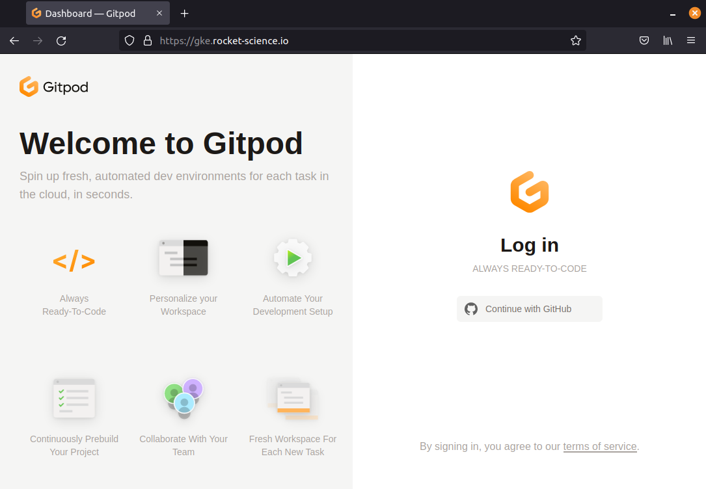

# Running Gitpod in [Azure AKS](https://azure.microsoft.com/en-gb/services/kubernetes-service/)

Before starting the installation process, you need:

- An Azure account
  - [Create one now by clicking here](https://azure.microsoft.com/en-gb/free/)
- Azure [service principal](https://docs.microsoft.com/en-us/azure/active-directory/develop/howto-create-service-principal-portal). This needs to have "Owner" IAM rights on the subscription and set up with "Group Administrator" ActiveDirectory role
  - Log into [portal.azure.com](https://portal.azure.com/) and navigate to [Azure Active Directory](https://portal.azure.com/?quickstart=True#blade/Microsoft_AAD_IAM/ActiveDirectoryMenuBlade/Overview).
  - Select the [Roles and Administrators](https://portal.azure.com/?quickstart=True#blade/Microsoft_AAD_IAM/ActiveDirectoryMenuBlade/RolesAndAdministrators)
  - Select the role Groups Administrator
  - Select "Add assignments" and add your service principal
- A `.env` file with basic details about the environment.
  - We provide an example of such file [here](.env.example).
- [Docker](https://docs.docker.com/engine/install/) installed on your machine, or better, a Gitpod workspace :)

**To start the installation, execute:**

```shell
make install
```

The whole process takes around twenty minutes. In the end, the following resources are created:

- an AKS cluster running Kubernetes v1.20.
- Azure load balancer.
- ~~Azure MySQL database.~~ MySQL will be provided by Helm under [#5508](https://github.com/gitpod-io/gitpod/issues/5508) solved
- ~~Azure Blob Storage.~~ Minio will be used until [Azure storage gateway](https://github.com/gitpod-io/gitpod-azure-aks-guide/issues/1) is configured
- Azure DNS zone.
- Azure container registry.
- [calico](https://docs.projectcalico.org) as CNI and NetworkPolicy implementation.
- [cert-manager](https://cert-manager.io/) for self-signed SSL certificates.
- [Jaeger operator](https://github.com/jaegertracing/helm-charts/tree/main/charts/jaeger-operator) - and Jaeger deployment for gitpod distributed tracing.
- [gitpod.io](https://github.com/gitpod-io/gitpod) deployment.

### Common errors running make install

- Insufficient regional quota to satisfy request

  Depending on the size of the configured `disks size` and `machine-type`,
  it may be necessary to request an [increase in the service quota](https://docs.microsoft.com/en-us/azure/azure-resource-manager/management/azure-subscription-service-limits)

  *After increasing the quota, retry the installation running `make install`*

## Verify the installation

First, check that Gitpod components are running.

```shell
kubectl get pods 
NAME                                 READY   STATUS    RESTARTS   AGE
blobserve-5584456c68-t2vf6           2/2     Running   0          7m40s
content-service-69fbcdf9fc-ngq9n     1/1     Running   0          7m39s
dashboard-86877b7779-8rtdj           1/1     Running   0          7m40s
image-builder-6557d4b5cf-xl9xf       3/3     Running   0          7m39s
jaeger-5dfd44f668-8tj9x              1/1     Running   0          7m46s
messagebus-0                         1/1     Running   0          7m40s
minio-76f8b45fb7-brr96               1/1     Running   0          7m40s
mysql-0                              1/1     Running   0          7m40s
proxy-69d87469f9-fdx9l               1/1     Running   0          7m40s
proxy-69d87469f9-qsmwg               1/1     Running   0          7m40s
registry-facade-5xlhh                2/2     Running   0          7m39s
registry-facade-qzmft                2/2     Running   0          7m39s
registry-facade-vk9q4                2/2     Running   0          7m39s
server-6bfdcbfd5b-2kwbt              2/2     Running   0          7m39s
ws-daemon-7fqd5                      2/2     Running   0          7m39s
ws-daemon-jl46t                      2/2     Running   0          7m39s
ws-daemon-q9k9l                      2/2     Running   0          7m39s
ws-manager-66f6b48c8-ts286           2/2     Running   0          7m40s
ws-manager-bridge-5dfb558c96-kcxvr   1/1     Running   0          7m40s
ws-proxy-979dd587b-ghjf4             1/1     Running   0          7m39s
ws-proxy-979dd587b-mtkxt             1/1     Running   0          7m39s
```

### Test Gitpod workspaces

When the provisioning and configuration of the cluster is done, the script shows the URL of the load balancer,
like:

Please open the URL `https://<domain>/workspaces`.
It should display the Gitpod login page similar to the next image.

*DNS propagation* can take several minutes.



----

## Update Gitpod auth providers

Please check the [OAuth providers integration documentation](https://www.gitpod.io/docs/self-hosted/0.5.0/install/oauth) expected format.

We provide an [example here](./auth-providers-patch.yaml). Fill it with your OAuth providers data.

```console
make auth
```

> We are aware of the limitation of this approach, and we are working to improve the Helm chart to avoid this step.

## Destroy the cluster and Azure resources

Remove the Azure cluster running:

```shell
make uninstall
```

> The command asks for a confirmation:
> `Are you sure you want to delete: Gitpod (y/n)?`

This will destroy the Kubernetes cluster and allow you to manually delete the cloud storage.
